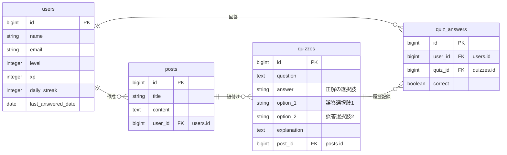

# Code Understanding Quiz

## アプリの概要

### **AIがあなたが投稿したコードからクイズを自動作成し、理解度を楽しく深めることができる学習プラットフォームです。**

自身の書いたプログラムや学習中のコードを投稿するだけで、AIがそのコードから最適な三択クイズを作成。回答を繰り返すことで、コードのロジックや仕様への深い理解をサポートします。

## アプリのスクリーンショット

  

### 【デモ動画：クイズ生成の様子】

  

## サービスのURL

https://code-understanding-quiz.onrender.com/

## アプリの使い方

1. **ログイン/ゲストログイン**: アカウントを作成するか、ワンクリックで体験できるゲストログインを利用します。
2. **コードの投稿**: 理解を深めたいコードをタイトルと共に投稿します。
3. **クイズ生成**: 投稿詳細画面から「AIで新しいクイズを作る」ボタンをクリック。AIがコードを解析し、問題を作成します。
4. **回答・学習**: 作成されたクイズに回答。正解すると経験値(XP)が獲得でき、レベルアップの要素も楽しめます。
5. **復習**: 蓄積された過去のクイズや、公式ドリルにいつでも挑戦して知識を定着させることができます。

## 開発のきっかけ

AIに指示を出せば、まるで魔法のように完成されたコードが返ってきます。しかし、プログラムが正常に動いていても、心のどこかで「本当はよく分かっていないのではないか」という強い焦りを感じることがありました。

AIが何でもやってくれる今だからこそ、ただ動くだけで満足せず、自分自身ももっとプログラミングを深く理解して、成長していきたい。

そんな思いから、このアプリを作成しました。

## コンセプト

このアプリは、既に用意されたクイズではなく、「自分がAIに指示して作ってもらったコード」を題材に、その中身をどれだけ理解できているかを確認するためのトレーニングツールです。

クイズ形式でコードの内容について問われることで、つい読み飛ばしてしまいがちなコードをじっくり読み解くきっかけを作ります。なんとなくの「分かったつもり」を卒業して、楽しみながら理解を深めていくことを目指しています。

## 工夫したところ（技術的なこだわり）

- **AIプロンプトの最適化**: 回答の選択肢が紛らわしくなりすぎず、かつ本質を突いたものになるよう、システムプロンプトの調整を繰り返しました。
- **自分にぴったりの難易度**: AIが今の自分のレベルに合わせて問題を調整してくれるので、無理なく一歩ずつ進めます。
- **ゲーミフィケーション**: ストリーク機能（継続日数）やコンボボーナス、経験値(XP)によるレベル上げ・称号システムを導入し、学習を継続したくなる仕組みを構築しました。
- **直感的なナビゲーション設計**: ユーザーの閲覧履歴に応じた動的な「戻る」ボタンの実装や、Hotwire/Turboを活用した快適な画面遷移など、ストレスのないUXを追求しました。

## ER図

## 技術スタック

- **Backend**: Ruby 3.4.1 / Ruby on Rails 7.1.6
- **Frontend**: Tailwind CSS / Hotwire (Turbo / Stimulus)
- **Database**: PostgreSQL
- **AI**: Gemini API
- **Infrastructure**: Render
- **Testing**: RSpec / Selenium (System Spec)
- **Linter**: RuboCop

## 今後の展望（追加予定の機能）

より深い学習体験を提供するために、以下の機能の追加を検討しています。

- **モバイルUXの更なる最適化**: 現状のレスポンシブ対応に加え、スマートフォン特有のタッチ操作（スワイプ等）への最適化や、隙間時間での学習効率を最大化するモバイル専用UIの磨き込み
- **AIとの対話型QA**: クイズの解説を読んでも解決しない疑問を、その場でAIに直接質問できる機能
- **GitHub連携**: 自分のリポジトリにあるコードを直接読み込み、開発ログに基づいた実戦的なクイズを作成
- **パーソナライズ・ロードマップ**: 過去の回答データをAIが分析し、苦手な構文やロジックを重点的に学べるカリキュラムを自動生成
- **多言語プロンプトの高度化**: フレームワークやライブラリ特有の仕様に特化したより深いクイズ生成
